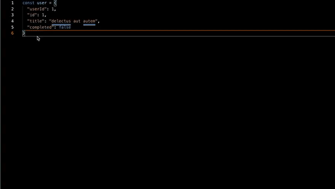

# json-to-gql README

Copy JSON as a simple GraphQL type.

## Features

The JSON to GraphQL conversion is added to your clipboard for use in your schema.

## Known Issues

Calling out known issues can help limit users opening duplicate issues against your extension.

## Release Notes

Users appreciate release notes as you update your extension.

### 1.0.0

Initial release of json-to-gql

-----------------------------------------------------------------------------------------------------------

### Thank you to

* [Walmart Labs](https://github.com/walmartlabs/json-to-simple-graphql-schema)
* [Node Copy Paste](https://www.npmjs.com/package/node-copy)

**Enjoy!**
